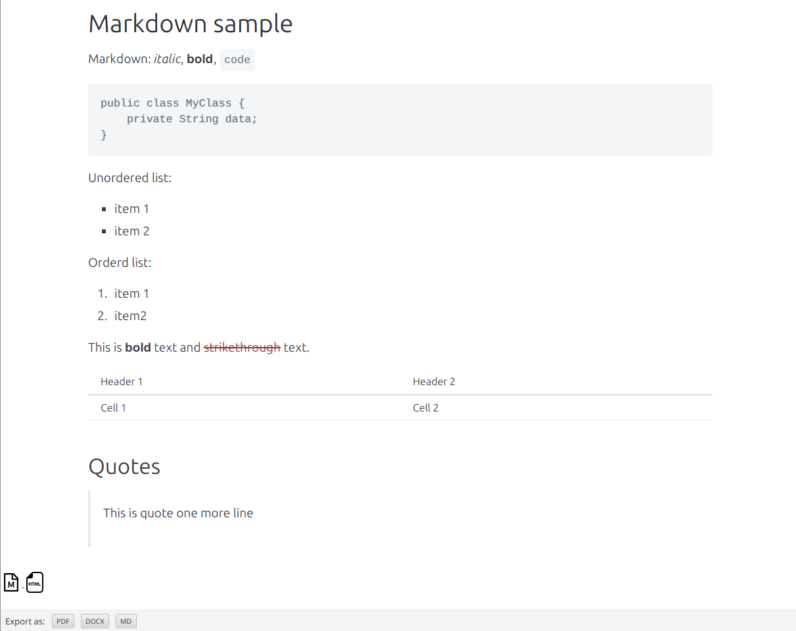
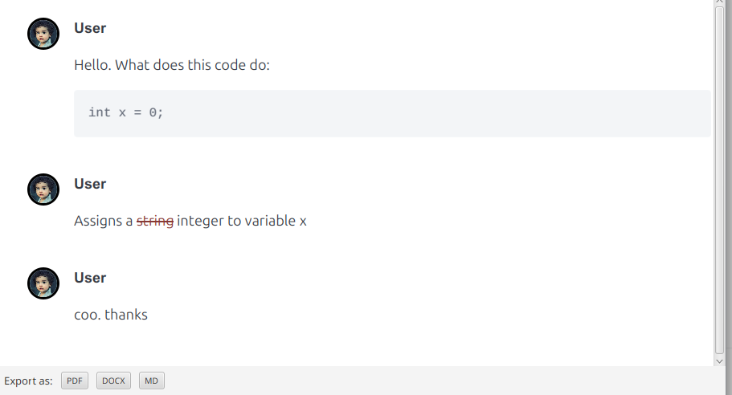
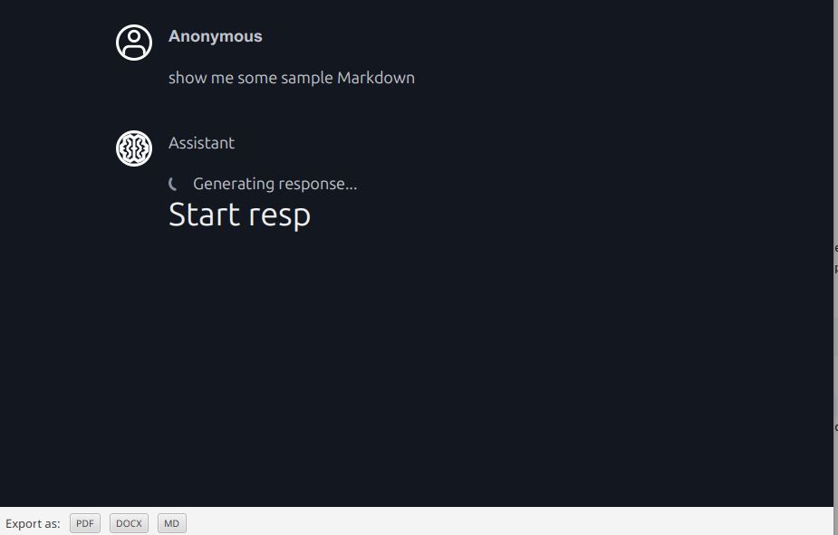

# mdview-fx

JavaFX-based Markdown viewer with support for simple chat and AI-based chat functionality. It allows viewing of static Markdown files ,
as well as interacting with AI models for dynamic content generation and chat capabilities.

Raw markdown is rendered as HTML and displayed in a JavaFX WebView component. The application supports advanced Markdown syntax via Flexmark-java plugins.

## Installation

Library is available on Maven Central. Add the following dependency to your `pom.xml`:

```xml
<dependency>
    <groupId>co.bitshifted</groupId>
    <artifactId>mdview-fx</artifactId>
    <version>1.0.0</version>
</dependency>
```

Requires Java 25 or higher.

## Usage

There are 3 primary usage scenarios for this library. Each one will be covered in the following sections.

### Static Markdown Viewing

This mode allows for loading and rendering static Markdown content from files.

```java
import co.bitshifted.mdviewfx.MarkdownBasicView;

var markdownContent = """
          # Markdown sample
        
                   Markdown: *italic*, **bold**, `code`
                   ```
                   public class MyClass {
                       private String data;
                   }
                   ```
                   Unordered list:
                   * item 1
                   * item 2
        
                   Orderd list:
                   1. item 1
                   1. item2
        
                   This is **bold** text and ~~strikethrough~~ text.
        
                  | Header 1 | Header 2 |
                  | -------- | -------- |
                  | Cell 1   | Cell 2   |
        
                  ## Quotes
        
                  > This is quote
                  > one more line
""";

var viewer = new MarkdownBasicView();
viewer.loadMarkdown(markdownContent);
```

This results in a JavaFX WebView displaying the rendered Markdown content.

[]

The view shows 2 floating buttons in lower left cornet which allows for copying markdown or HTML content to clipbord. There is a toolbar at the bottonm which allows 
to export content to PDF, Word or Markdown file.

### Chat view

This mode allows for a simple chat interface where users can send messages and receive responses. Messages are sent as Markdown, and rendered as rich text, similar to Slack.
There is an implementation of `ChatHistoryProvider` which loads messages from history, as user scrolls up the chat window.

```java
var historyProvider = new InMemoryChatHistoryProvider();
var chatView = new MarkdownChatView(historyProvider);
historyProvider.loadMessageHistory(); // optional, loads messages from history into the chat view
```

All exchanged messages are stored in the `ChatHistoryProvider` implementation, which can be customized to store messages in memory, a database, or any other storage mechanism.

Example screenshot of the chat view:

[]

### AI Chat view

This mode allows for an AI-powered chat interface where users can send messages and receive AI-generated responses. Response is streamed in real time, allowing for a more interactive experience. 

```java
var aiHistory = new InMemoryChatHistoryProvider();
var aiView = new MarkdownAiChatView(aiHistory, ViewMode.DARK);
aiHistory.loadMessageHistory();
```

Example screenshot of the AI chat view:

[]

### View Mode /Theme

UI supports light and dark mode. It can be set using `ViewMode` enum in the constructor of the view. Default is light mode.

```java
var chatView = new MarkdownChatView(historyProvider, ViewMode.DARK);
var aiView = new MarkdownAiChatView(aiHistory, ViewMode.LIGHT);
```

### Content Export and Copy

Each view provides a toolbar with options to export the content to PDF, Word, or Markdown file. Additionally, there are floating buttons for copying the raw Markdown or rendered HTML content to the clipboard.

It is possible to copy the content of individual messages in the chat views by clicking on the copy floating button next to each message.

It is also possible to disable showing export toolbar, by using a constructor with specific arguments:

```java
var view = new MarkdownBasicView(true); // set to true to hide export toolbar
```
Refer to Javadoc for constructor parameters.

### Chat history providers

Chat history provider allows pulling chat messages from history, regardless of where the history is stored, ie. from memory, files, database, API endpoints etc. Several implementations come out of the box,
and you can easily provide custom implementations by extending `ChatHistoryProvider` class.

Library comes with the following providers out of the box:

#### `InMemoryChatHistoryProvider`

This is the simplest implementation which simply stores which ever messages are currently present in chat. It does not fetch any historycal messages unless overriden and explicitely implemented.

#### `HttpChatHistoryProvider`

Chat history provider that fetches message history from HTTP API. It provides simple HTTP client that fetches the messages from specified URL and in given format. Constructor takes 2 parameters:

* `requestSupplier` - returns `java.net.http.HttpRequest` that connect to given HTTP API endpoint
* `responseParser` - converts response from HTTP API into `ChatMessage`

Code sample:

```java
// simplest parser that always returns the same message
// in reality, you will probably parse JSON array into list of messages
Function<HttpResponse<String>, List<ChatMessage>> responseParser =
      response -> List.of(new ChatMessage("1", MessageType.PARTICIPANT, "Hello, world!"));

var url = "http://localhost:8080/chat-history";
Supplier<HttpRequest> requestSupplier =
        () -> HttpRequest.newBuilder().uri(java.net.URI.create(url)).GET().build();
var provider = new HttpChatHistoryProvider(requestSupplier, responseParser);
provider.loadMessageHistory();
```
 

## Sample application

Sample application can be found in `sample-app` directory.

# License

This project is licensed under Mozilla Public License 2.0. See the [LICENSE](LICENSE) file for details.


